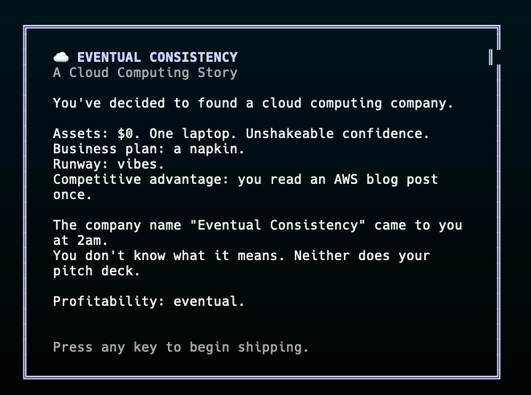
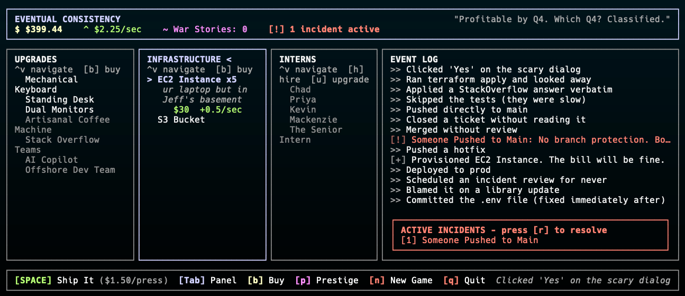

# Eventual Consistency

> *"Profitable by Q4. Which Q4? Classified."*

A terminal-based incremental game, set inside a cloud computing startup that is definitely disrupting the space. You start with nothing but a laptop and unshakeable confidence. You end up owning us-east-1.





Built with [Bun](https://bun.sh) and [Ink](https://github.com/vadimdemedes/ink).

---

## Requirements

- [Bun](https://bun.sh) v1.0 or later

Install Bun if you don't have it:

```bash
curl -fsSL https://bun.sh/install | bash
```

---

## Install

Clone the repo and install dependencies:

```bash
git clone https://github.com/thestuckster/EventualConsistency.git
cd EventualConsistency
bun install
```

---

## Run

```bash
bun run index.ts
```

That's it. Your cloud empire awaits.

---

## Play from anywhere (global command)

To run the game as a simple `cloud` command from any terminal:

```bash
bun link
```

This registers the project globally. You can now start the game with:

```bash
cloud
```

To unlink later:

```bash
bun unlink eventualconsistency
```

**Alternative — shell alias:**

If you prefer not to use `bun link`, add this to your `~/.zshrc` or `~/.bashrc`:

```bash
alias cloud="bun run /path/to/EventualConsistency/index.ts"
```

Then reload your shell:

```bash
source ~/.zshrc
```

---

## Controls

| Key | Action |
|---|---|
| `SPACE` | **Ship It** — manual action, earns Cloud Credits |
| `Tab` | Cycle focus between the three panels |
| `↑` / `↓` | Navigate within the focused panel |
| `b` | Buy the selected infrastructure or upgrade |
| `h` | Hire the selected intern |
| `u` | Level up the selected intern |
| `r` | Manually resolve the oldest active incident |
| `p` | Open the Cloud Migration (prestige) screen |
| `n` | Start a new game (with confirmation) |
| `q` | Quit (saves automatically; press again to confirm) |

---

## Game Concepts

### Cloud Credits

Cloud Credits are the only currency. You earn them by shipping code manually, through passive infrastructure income, or by coming back after being away. You spend them on upgrades, infrastructure, and interns.

### Ship It (Manual Income)

Press `SPACE` to manually ship code and earn credits. Early in the game this is your primary income. The amount earned per press is shown in the bottom bar. It scales up as you purchase click upgrades and infrastructure.

### Upgrades

The **Upgrades panel** (left) contains one-time purchases that permanently increase your income per `SPACE` press — from a Mechanical Keyboard (+1/click) up to an Offshore Dev Team (+50/click). Buy these first to make manual play worthwhile before automation takes over.

### Infrastructure

The **Infrastructure panel** (middle) is where you automate income. Each tier earns Cloud Credits per second passively, loosely based on real AWS services:

| Tier | Name | The joke |
|---|---|---|
| 1 | EC2 Instance | ur laptop but in Jeff's basement |
| 2 | S3 Bucket | a bucket you will never empty |
| 3 | Lambda Function | serverless! (the servers are just hidden) |
| 4 | RDS Database | goes down during demos. Guaranteed. |
| … | … | … |
| 14 | us-east-1 | an entire region. don't ask why it keeps going down. |

Each tier unlocks after you've bought at least one of the previous tier. Costs scale with quantity owned (`baseCost × 1.15^owned`).

### Incidents

As your infrastructure grows, random incidents start firing — S3 buckets made public, region outages, someone pushing directly to main. Each one applies a negative effect (reduced income, credit drain, or a full halt) until resolved.

Resolve manually with `r`, or hire interns to handle them automatically.

### Interns

The **Interns panel** (right) lets you hire five interns, each specializing in a type of incident:

| Intern | Specialty | Their approach |
|---|---|---|
| Chad | EC2, region outages | "Rebooted it. Didn't check why." |
| Priya | IAM, public buckets | "Added a policy. Also broke staging." |
| Kevin | Database incidents | "Turned it off and on. It's fine now probably." |
| Mackenzie | Lambda, cold starts | "Rewrote it in Rust without telling anyone." |
| The Senior Intern | Everything | "I've seen this before." (They haven't.) |

Interns auto-resolve matching incidents but have a chance of introducing a *side effect* — a new incident caused by their fix. Side effect chance decreases as you level them up (Junior → Mid → Staff). The Senior Intern is expensive and slightly smug but covers all incident types.

### Offline Earnings

When you close the game and come back, your infrastructure keeps earning — at 60% of its normal rate, capped at 24 hours. The servers were napping too.

### Cloud Migration (Prestige)

Once you've earned enough credits, you can **prestige** by migrating to a new cloud provider. This resets all credits and infrastructure but awards a **War Story** — a permanent multiplier that carries across all future runs.

| Migration | Tagline | Reward |
|---|---|---|
| Migrate to GCP | "The grass is greener (it isn't)" | +50% global $/sec |
| Go Multi-Cloud | "Best of both worlds (worst of both worlds)" | Intern efficiency ×2 |
| Go Serverless-First | "No servers! (still servers)" | Incidents -30% frequency |
| Edge Computing | "Put the compute... everywhere?" | Click income ×5 |
| On-Prem Again | "We've come full circle" | Unlock secret infrastructure tier |

There are five migrations. After the fifth, you have achieved Eventual Consistency. The data is still inconsistent.

### Milestones

At certain total credit thresholds, the event log prints a story beat. These range from "You've bootstrapped. No VC would take your call anyway." all the way to "You've achieved Eventual Consistency." They do nothing mechanically. They are for you.

---

## Plugins

The game has a plugin system. Drop a `.ts` or `.js` file into `~/.eventual-consistency/plugins/` and it loads automatically on startup. Plugins can add new infrastructure, interns, incidents, and upgrades; react to game events; add keybindings; and build entirely new UI panels.

| Doc | Description |
|-----|-------------|
| [Getting Started](./docs/plugins/getting-started.md) | Install your first plugin in under 5 minutes |
| [How It Works](./docs/plugins/how-it-works.md) | Loading lifecycle, content injection, hooks, and mechanics |
| [API Reference](./docs/plugins/api-reference.md) | Every interface, field, hook, and type |

---

## Save File

Your game is saved automatically every 30 seconds and on quit. Save data lives at:

```
~/.eventual-consistency/save.json
```

Delete this file to start fresh manually, or use `n` in-game.

---

## Architecture

```
src/
├── components/        React/Ink UI components
│   ├── App.tsx        Root layout, game loop, input handling
│   ├── Header.tsx     Credits, $/sec, war stories
│   ├── UpgradePanel.tsx
│   ├── InfraPanel.tsx
│   ├── InternPanel.tsx
│   ├── EventLog.tsx
│   ├── StatusBar.tsx
│   ├── PrestigeScreen.tsx
│   └── QuitScreen.tsx
├── game/              Pure game logic, no UI
│   ├── state.ts       GameState type + useReducer hook
│   ├── infrastructure.ts
│   ├── upgrades.ts
│   ├── interns.ts
│   ├── incidents.ts
│   ├── prestige.ts
│   └── persistence.ts Save/load + offline earnings
└── data/
    └── flavor.ts      Rotating text, milestones
```
